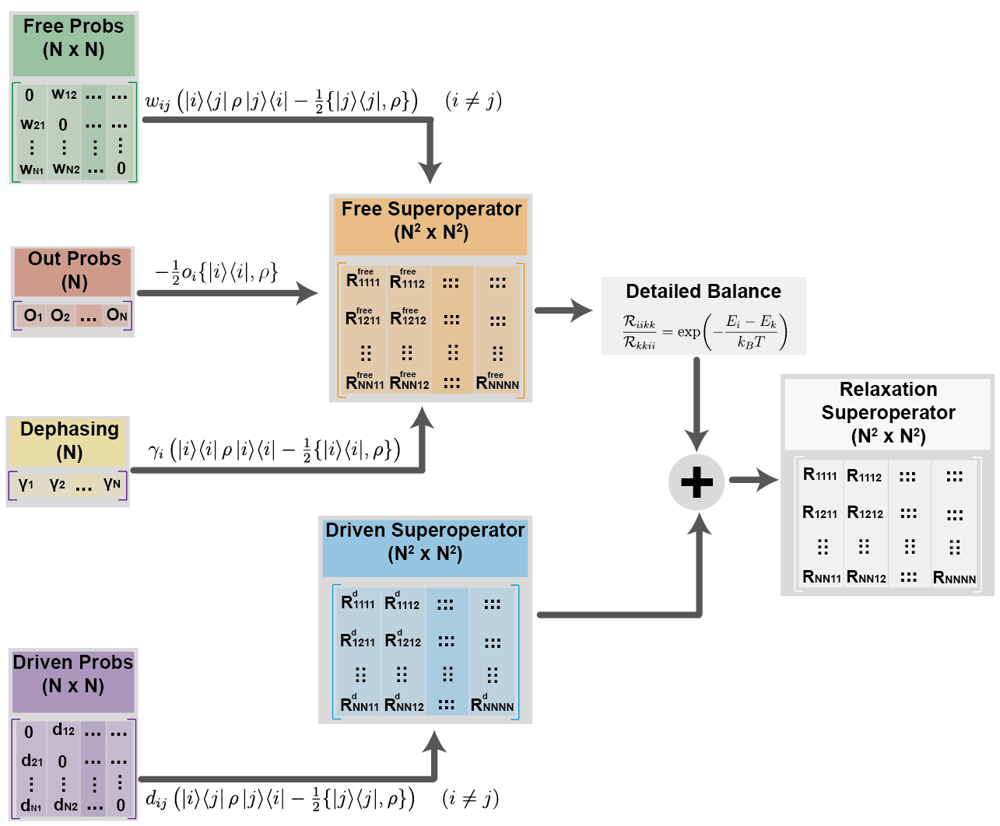

.. _superoperator_creation:

Lindblad Superoperator Construction
====================================

MarS uses the *Lindblad master equation* formalism to construct physically valid relaxation superoperators from user-defined parameters.
This approach guarantees that the density matrix remains positive semi-definite and trace-preserving (if outgoing probabilities equal to zero) during time evolution.

The Lindblad Master Equation
-----------------------------

The time evolution of the density matrix :math:`\hat{\rho}(t)` is governed by the Liouville-von Neumann equation with relaxation:

.. math::

   \frac{d\hat{\rho}}{dt} = -i[\hat{H}, \hat{\rho}] + \hat{\mathcal{R}}[\hat{\rho}]

where:

- :math:`\hat{H}` is the spin Hamiltonian
- :math:`\hat{\mathcal{R}}` is the relaxation superoperator

The most general Markovian relaxation that preserves positivity and trace is given by the **Lindblad form**:

.. math::

   \hat{\mathcal{R}}[\hat{\rho}] = \sum_k \left( \hat{L}_k \hat{\rho} \hat{L}_k^\dagger - \frac{1}{2} \{\hat{L}_k^\dagger \hat{L}_k, \hat{\rho}\} \right)

where:

- :math:`\hat{L}_k` are **Lindblad operators** (jump operators)
- :math:`\{A, B\} = AB + BA` is the anticommutator

Physical Interpretation
------------------------

Each Lindblad term has two components:

1. **Jump term** :math:`\hat{L}_k \hat{\rho} \hat{L}_k^\dagger`: Describes the system transitioning to a new state

2. **Decay term** :math:`-\frac{1}{2} \{\hat{L}_k^\dagger \hat{L}_k, \hat{\rho}\}`: Ensures trace preservation by accounting for population loss from the initial state

Mapping Relaxation Parameters to Lindblad Operators
----------------------------------------------------

MarS maps the four relaxation parameter types to specific Lindblad operators:

Out Probabilities → Loss Operators
^^^^^^^^^^^^^^^^^^^^^^^^^^^^^^^^^^^

For population loss from level :math:`|i\rangle` at rate :math:`o_i`:

.. math::

   \hat{L}_i = \sqrt{o_i} \, |i\rangle\langle i|

**Relaxation contribution:**

.. math::

   \hat{\mathcal{R}}_{\text{out}}[\hat{\rho}] = \sum_i o_i \left( |i\rangle\langle i| \hat{\rho} |i\rangle\langle i| - \frac{1}{2} \{|i\rangle\langle i|, \hat{\rho}\} \right)

This simplifies to:

.. math::

   \hat{\mathcal{R}}_{\text{out}}[\hat{\rho}] = -\frac{1}{2} \sum_i o_i \, \{|i\rangle\langle i|, \hat{\rho}\}

**Implementation:** See :func:`mars.population.transform.Liouvilleator.anticommutator_superop_diagonal` for the anticommutator construction.

Free Probabilities → Spontaneous Transition Operators
^^^^^^^^^^^^^^^^^^^^^^^^^^^^^^^^^^^^^^^^^^^^^^^^^^^^^^

For spontaneous transitions :math:`|j\rangle \to |i\rangle` at rate :math:`w_{ij}`:

.. math::

   \hat{L}_{ij} = \sqrt{w_{ij}} \, |i\rangle\langle j|

**Relaxation contribution:**

.. math::

   \hat{\mathcal{R}}_{\text{free}}[\hat{\rho}] = \sum_{i \neq j} w_{ij} \left( |i\rangle\langle j| \hat{\rho} |j\rangle\langle i| - \frac{1}{2} \{|j\rangle\langle j|, \hat{\rho}\} \right)

This can be written as:

.. math::

   \hat{\mathcal{R}}_{\text{free}}[\hat{\rho}] = \sum_{i \neq j} w_{ij} \left( |i\rangle\langle i| \rho_{jj} - \frac{1}{2} \{|i\rangle\langle i| + |j\rangle\langle j|, \hat{\rho}\} \right)

This term:

- Increases population of :math:`|i\rangle` at rate :math:`w_{ij} \rho_{jj}`
- Decreases population of :math:`|j\rangle` at rate :math:`\sum_i w_{ij} \rho_{jj}`

**Implementation:** See :func:`mars.population.transform.Liouvilleator.lindblad_dissipator_superop` for the full construction.

Driven Probabilities → Stimulated Transition Operators
^^^^^^^^^^^^^^^^^^^^^^^^^^^^^^^^^^^^^^^^^^^^^^^^^^^^^^^

For driven transitions :math:`|j\rangle \to |i\rangle` at rate :math:`d_{ij}`:

.. math::

   \hat{L}_{ij} = \sqrt{d_{ij}} \, |i\rangle\langle j|

**Relaxation contribution:**

.. math::

   \hat{\mathcal{R}}_{\text{driv}}[\hat{\rho}] = \sum_{i \neq j} d_{ij} \left( |i\rangle\langle j| \hat{\rho} |j\rangle\langle i| - \frac{1}{2} \{|j\rangle\langle j|, \hat{\rho}\} \right)

This term is same form as free probabilities, but not modified by detailed balance constraints.

**Implementation:** See :func:`mars.population.transform.Liouvilleator.lindblad_dissipator_superop` for the full construction.

Dephasing
^^^^^^^^^^^^^^^^^^^^^^^^^^^^^^^^^^^^^

For pure dephasing of level :math:`|i\rangle` at rate :math:`\gamma_i`:

.. math::

   \hat{L}_i = \sqrt{\gamma_i} \, |i\rangle\langle i|

**Relaxation contribution:**

.. math::

   \hat{\mathcal{R}}_{\text{deph}}[\hat{\rho}] = \sum_i \gamma_i \left( |i\rangle\langle i| \hat{\rho} |i\rangle\langle i| - \frac{1}{2} \{|i\rangle\langle i|, \hat{\rho}\} \right)

For off-diagonal elements (:math:`i \neq j`):

.. math::

   \frac{d\rho_{ij}}{dt}\Big|_{\text{deph}} = -\frac{\gamma_i + \gamma_j}{2} \, \rho_{ij}

**Implementation:** See :func:`mars.population.transform.Liouvilleator.lindblad_dephasing_superop` for the construction.

Separation into Free and Driven Components
-------------------------------------------

MarS internally separates the total relaxation superoperator:

.. math::

   \hat{\mathcal{R}} = \hat{\mathcal{R}}_{\text{free}} + \hat{\mathcal{R}}_{\text{driv}}

where:

**Free relaxation** :math:`\hat{\mathcal{R}}_{\text{free}}`:

- Includes: out_probs, free_probs, dephasing
- Modified them to enforce detailed balance at temperature :math:`T`

**Driven relaxation** :math:`\hat{\mathcal{R}}_{\text{driv}}`:

- Includes: driven_probs or user-defined relaxation superoperator
- This term remains as specified by user

Liouville Space Representation
-------------------------------

For numerical computation, the superoperator is represented in **Liouville space** where:

- Density matrix :math:`\hat{\rho}` (dimension :math:`N \times N`) → vector :math:`|\rho\rangle\rangle` (dimension :math:`N^2`)
- Superoperator :math:`\hat{\mathcal{R}}` → matrix (dimension :math:`N^2 \times N^2`)

The transformation is:

.. math::

   \hat{\mathcal{L}} = -i(\hat{H} \otimes \mathbb{I} - \mathbb{I} \otimes \hat{H}^T) + \hat{\mathcal{R}}

where :math:`\mathbb{I}` is the identity operator.

**Key Functions:**

- :func:`mars.population.transform.Liouvilleator.vec` - Convert density matrix to vector
- :func:`mars.population.transform.Liouvilleator.unvec` - Convert vector back to matrix
- :func:`mars.population.transform.Liouvilleator.hamiltonian_superop` - Create Hamiltonian superoperator

References
----------

1. Lindblad, G. (1976). "On the generators of quantum dynamical semigroups." *Communications in Mathematical Physics*, 48(2), 119-130. https://doi.org/10.1007/BF01608499

2. Breuer, H.-P., & Petruccione, F. (2002). *The Theory of Open Quantum Systems*. Oxford University Press.
